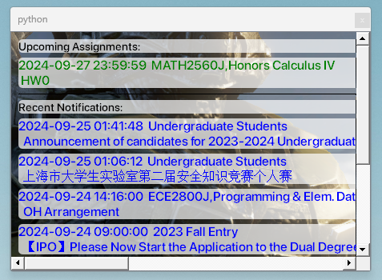

# Desktop Notes for JiCanvas

Created by Shihan Tang

## Source Code

The source code consists of two Python files.

## How to Use the Notes

Executables are located in the `./dist` directory.

### 0. Setup

Ensure you have Google Chrome installed and updated to version 129.  
The application uses `chromedriver` to open login pages.  
If your version is newer, download the appropriate `chromedriver` from [Chrome for Testing](https://googlechromelabs.github.io/chrome-for-testing/).

### 1. Login via JAccount
0. CLOSE your VPN!
1. Run `canvas_login.exe`.
2. A login page will open.

   
Also a terminal will open too. DON'T CLOSE IT
3. After logging in, you might see a session error.

   

    - This is expected. Click the "login" button on the left, then "login with jaccount".
    - You'll be redirected to the normal jicanvas dashboard.
4. Press Enter in the terminal that opens after running `canvas_login.exe`.
5. Wait for the terminal to close automatically.
6. If it's your first time running the executable, two files (`announcement.txt` and `assignment.txt`) will be created.

### 2. Create the Desktop Note

1. Run `note_creator.exe`.
2. The effect is shown below:

   
   (If you do not have `./dist/background.png`, the background will be white.)
3. You can move the window. It stays behind all windows but will reappear if you minimize an open window.
4. If there are too many labels, a scroll area will be created.
   

### 3. Customize the Window

#### Set a Custom Background
1. Copy your desired background image to the `/dist` directory.
2. Rename the image file to `background.png`.

#### Customize the Font
Although the UI for font customization is not implemented yet, you can manually change the font and styles in the code:

- **Font Color and Widget Background**:

  You can adjust the font color and the widget's background color by modifying the `setStyleSheet()` function. Here is an example:

  ```python
  setStyleSheet("background-color: rgba(255, 255, 255, 180); font-weight: bold; font-size: 14px; color: black; border-radius: 5px;")


- **Fonts**:

  To customize the font, you can choose a font from the `./Fonts` directory or specify another path. You can add a font using the following code:

  ```python
  font_id = QFontDatabase.addApplicationFont("./Fonts/SF-Pro-Display-Semibold.otf")
  ```

#### Create Executables with PyInstaller
Install the needed modules first. Once your customizations are done, you can package the application using PyInstaller:

```bash
pyinstaller --onefile your_script.py
```

This will create an executable with the custom background and font settings.
AND Don't forget to add the font(if from elsewhere) to the same relative path to your executable! (Like you can put it into `./dist/Fonts`)
### 4. Additional Notes For Usage

- `canvas_login.exe` collects data from the webpage and saves it to the two text files.
- You can run `note_creator.exe` directly if you have recently logged in.


