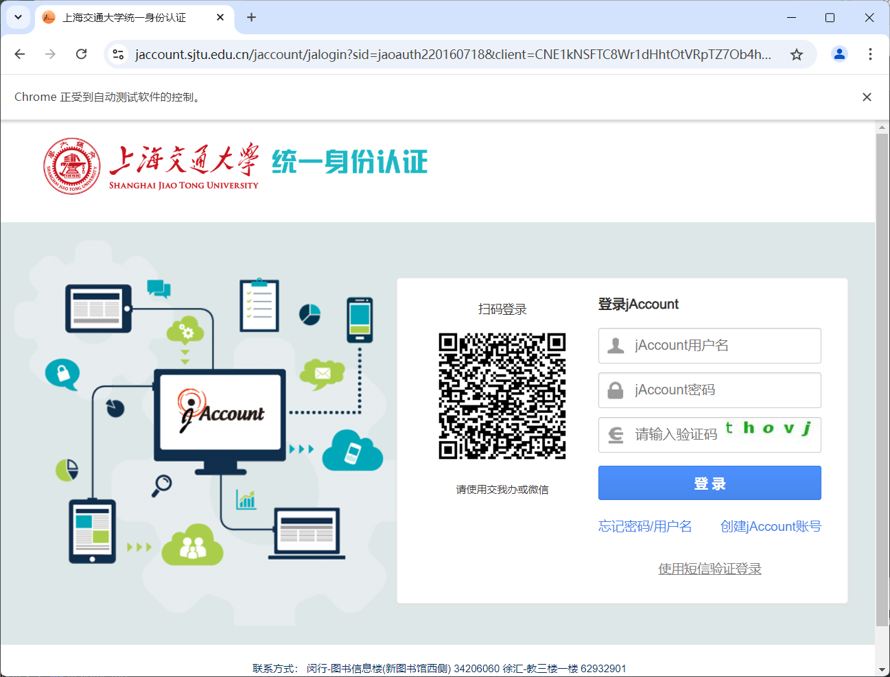
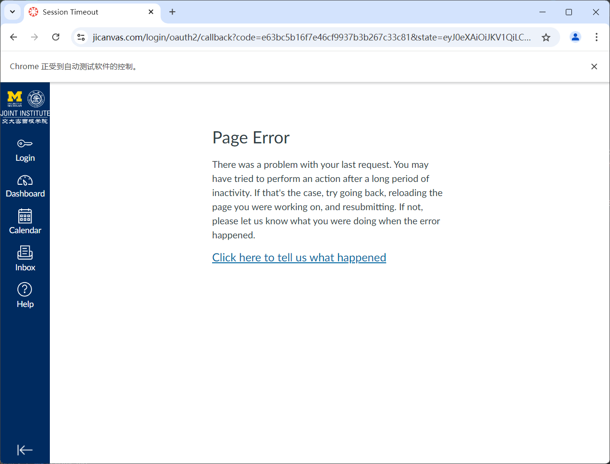
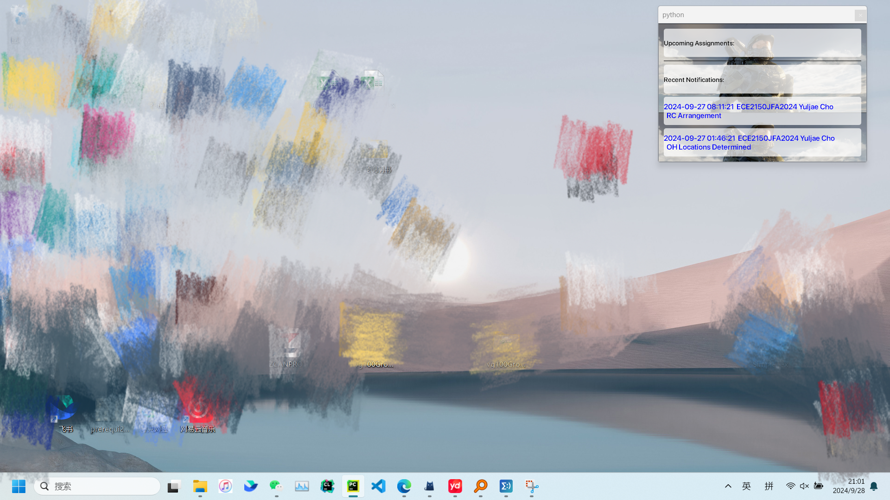

# Desktop Notes for JiCanvas

Created by Shihan Tang

## Source Code

The source code consists of two Python files.

## How to Use the Notes

Executables are located in the `./dist` directory.

### 0. Setup

Ensure you have Google Chrome installed and updated to version 129.  
The application uses `chromedriver` to open login pages.  
If your version is newer, download the appropriate `chromedriver` from [Chrome for Testing](https://googlechromelabs.github.io/chrome-for-testing/).

### 1. Login via JAccount

1. Run `canvas_login.exe`.
2. A login page will open.

   

3. After logging in, you might see a session error.

   

    - This is expected. Click the "login" button on the left, then "login with jaccount".
    - You'll be redirected to the normal jicanvas dashboard.
4. Press Enter in the terminal that opens after running `canvas_login.exe`.
5. Wait for the terminal to close automatically.
6. If it's your first time running the executable, two files (`announcement.txt` and `assignment.txt`) will be created.

### 2. Create the Desktop Note

1. Run `note_creator.exe`.
2. The effect is shown below:

   

3. You can move and resize the window. It stays behind all windows but will reappear if you minimize an open window.

### 3. Additional Notes

- `canvas_login.exe` collects data from the webpage and saves it to the two text files.
- You can run `note_creator.exe` directly if you have recently logged in.