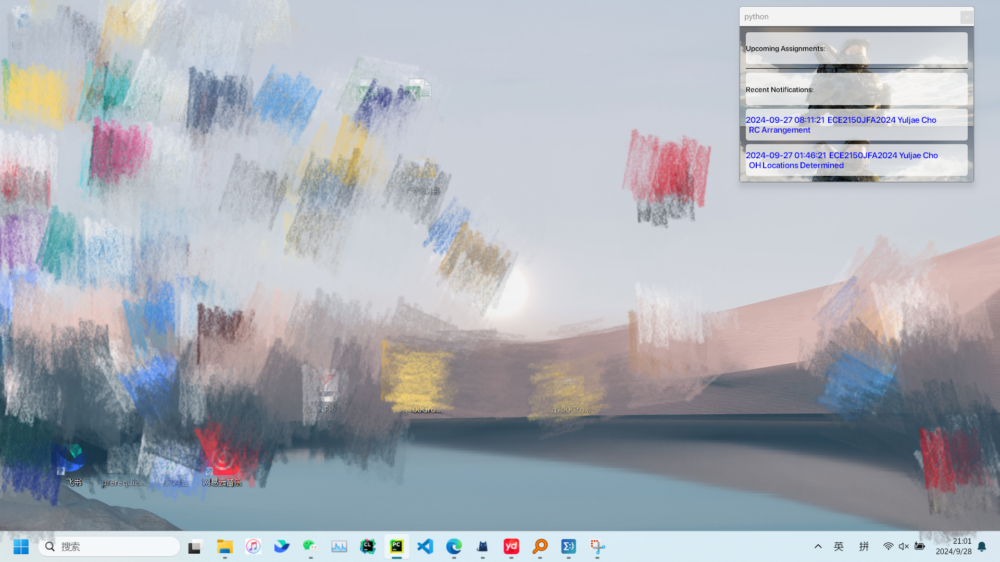
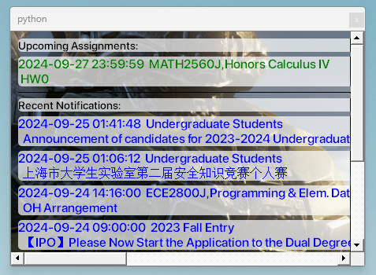

# JiCanvas 桌面便签

作者：Shihan Tang

## 源代码

源代码由两个 Python 文件组成。

## 如何使用便签

可执行文件位于 `./dist` 目录中。

### 0. 设置

确保你已安装并更新了 Google Chrome 至版本 129。  
该应用程序使用 `chromedriver` 来打开登录页面。  
如果你的 Chrome 版本更新了，请从 [Chrome for Testing](https://googlechromelabs.github.io/chrome-for-testing/) 下载相应的 `chromedriver`。

### 1. 通过 JAccount 登录
0. 关闭你的 VPN！
1. 运行 `canvas_login.exe`。
2. 登录页面会自动打开。

   
    同时一个终端也回打开。不要关！
3. 登录后，你可能会看到会话错误。

   

    - 这是正常的情况。点击左边的 "login" 按钮，然后选择 "login with jaccount"。
    - 你将被重定向到正常的 JiCanvas 仪表盘。
4. 在运行 `canvas_login.exe` 后出现的终端中按 Enter。
5. 等待终端自动关闭。
6. 如果这是你第一次运行该可执行文件，两个文件 (`announcement.txt` 和 `assignment.txt`) 会被创建。

### 2. 创建桌面便签

1. 运行 `note_creator.exe`。
2. 效果如下所示：

   
   （如果 `./dist/background.png` 文件不存在，背景将为白色。）
3. 你可以移动窗口。它会保持在所有窗口的底层，但如果你最小化任何打开的窗口，它会重新显示。
4. 如果条目数太多，将会创建一个滚动的区域。
   
### 3. 自定义窗口

#### 设置自定义背景
1. 将你想要使用的背景图片复制到 `/dist` 目录中。
2. 将图片文件重命名为 `background.png`。

#### 自定义字体
虽然还没有提供字体自定义的用户界面（UI），但你可以通过修改代码来手动更改字体和样式：

- **字体颜色和窗口背景颜色**：

  你可以通过调整 `setStyleSheet()` 函数来更改字体颜色和窗口背景颜色。例如：

  ```python
  setStyleSheet("background-color: rgba(255, 255, 255, 180); font-weight: bold; font-size: 14px; color: black; border-radius: 5px;")


- **自定义字体**：

  你可以从 `./Fonts` 目录中选择你想要的字体，或指定其他路径。可以使用以下代码添加字体：

  ```python
  font_id = QFontDatabase.addApplicationFont("./Fonts/SF-Pro-Display-Semibold.otf")
  ```

#### 使用 PyInstaller 创建可执行文件
首先安装所需的模块。一旦你完成了自定义设置，可以使用 PyInstaller 将应用程序打包为可执行文件：

```bash
pyinstaller --onefile your_script.py
```

这将创建一个包含自定义背景和字体设置的可执行文件。
如果字体来自其他路径，不要忘记将字体文件放置在与可执行文件相对的相同路径下！（例如，你可以把它放在 `./dist/Fonts` 目录中）

### 4. 使用的附加说明

- `canvas_login.exe` 会从网页中收集数据并保存到两个文本文件中。
- 如果你最近登录过，可以直接运行 `note_creator.exe`。

